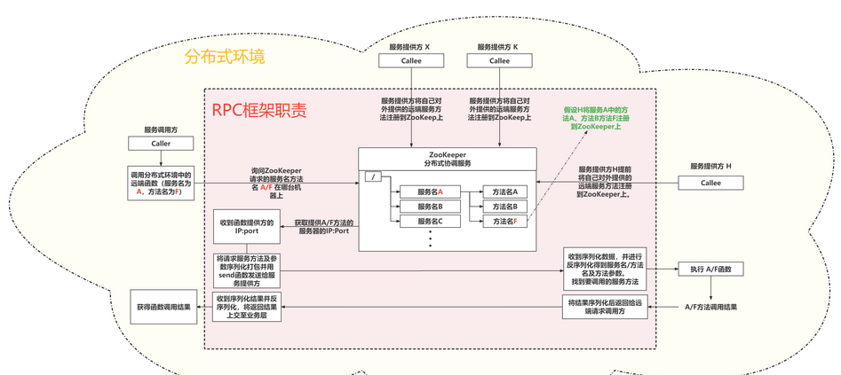
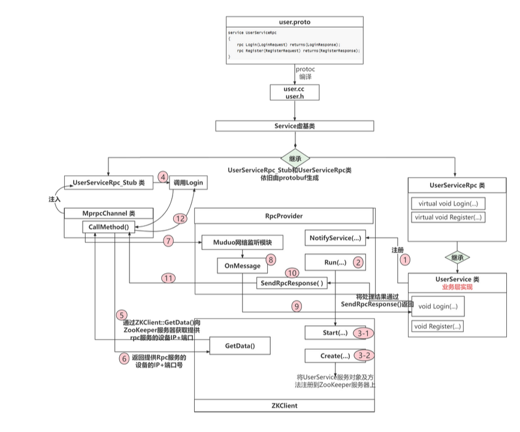
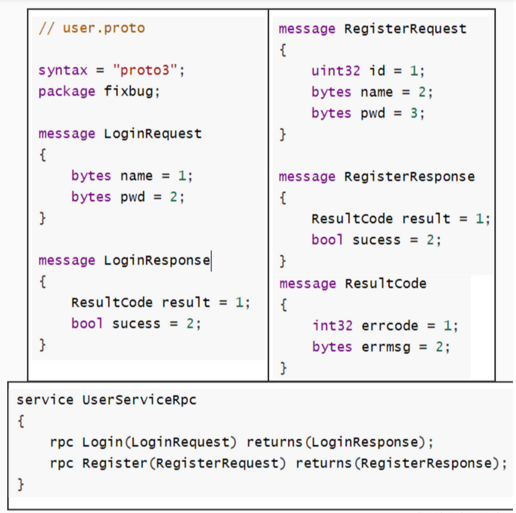
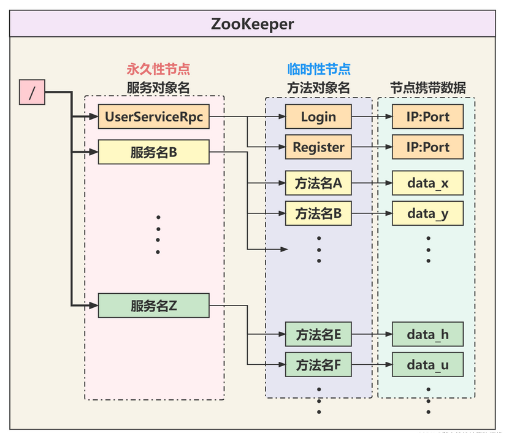
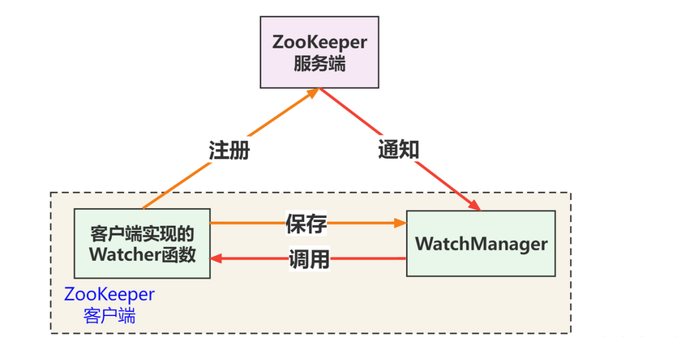

# 概述
RPC是远程过程调用（Remote Procedure Call）的缩写，可以通过网络从远程服务器上请求服务（调用远端服务器上的函数并获取返回结果）。简单来说，客户端程序可以像调用本地函数一样直接调用运行在服务端的函数。

## ZooKeeper
 ZooKeeper在这里作为服务方法的管理配置中心，负责管理服务方法提供者对外提供的服务方法。服务方法提供者提前将本端对外提供的服务方法名及自己的通信地址信息（IP:Port）注册到ZooKeeper。当Caller发起远端调用时，会先拿着自己想要调用的服务方法名询问ZooKeeper，ZooKeeper告知Caller想要调用的服务方法在哪台服务器上（ZooKeeper返回目标服务器的IP:Port给Caller），Caller便向目标服务器Callee请求服务方法调用。服务方在本地执行相应服务方法后将结果返回给Caller。
## ProtoBuf
  ProtoBuf能提供对数据的序列化和反序列化，ProtoBuf可以用于结构化数据的串行序列化，并且以Key-Value格式存储数据，因为采用二进制格，所以序列化出来的数据比较少，作为网络传输的载体效率很高。
 Caller和Callee之间的数据交互就是借助ProtoBuf完成，具体的使用方法和细节后面会进一步拓展。
## Muduo
 Muduo库是基于(Multi-)Reactor模型的多线程网络库，在RPC通信框架中涉及到网络通信。另外我们可以服务提供方实现为IO多线程，实现高并发处理远端服务方法请求。
# RPC框架

## 业务层实现
 RPC是一种通信协议，所以直接把RPC框架代码摆出来可能比较抽象，这里写一个简单的业务代码，这个通信框架找一个业务场景，之后再深入RPC框架内容。
## ProtoBuf协议数据结构定义
 RPC通信交互的数据在发送前需要用ProtoBuf进行二进制序列化，并且在通信双方收到后要对二进制序列化数据进行反序列化。双方通信时发送的都是固定结构的消息体，比如登录请求消息体（用户名+密码），注册请求消息体（用户id+用户名+消息体）。

本项目业务场景为Caller调用远端方法Login和Register。Caller中的Login函数接收一个LoginRequest消息体，执行完Login逻辑后将处理结果填写进LoginResponse消息体，再返回给Caller。调用Register函数过程同理。
 Callee对外提供远端可调用方法Login和Register，要在user.proto中进行注册（service UserServiceRpc）。在Callee中的Login方法接受LoginRequest message，执行完逻辑后返回LoginResponse message给Caller。
 注意UserServiceRpc就是我们所说的服务名，而Login和Register就是方法名。
 接着使用protoc来编译这个.proto文件
然后就能生成user.cc和user.h文件了。user.cc和user.h里面提供了两个非常重要的类供c++程序使用，其中UserServiceRpc_Stub类给caller使用，UserServiceRpc给callee使用。caller可以调用UserServiceRpc_Stub::Login(...)发起远端调用，而callee则继承UserServiceRpc类并重写UserServiceRpc::Login(...)函数，实现Login函数的处理逻辑。
 另外我们在user.proto中注册了通信的消息体（LoginRequest、LoginResponse、RegisterResponse（其中嵌套了ResultCode）），这些注册的消息体也会由protoc生成对应的C++类和业务代码友好交互。
```
protoc user.proto -I ./ -cpp_out=./user
```
### 业务层代码：
```c++
/****
文件注释：
文件名： calluserservice.cc
caller端代码：caller向callee发起远端调用，即caller想要调用处于callee中的Login函数。
****/
#include <iostream>
#include "mprpcapplication.h"
#include "user.pb.h"
#include "mprpcchannel.h"
int main(int argc, char **argv)
{
    MprpcApplication::Init(argc, argv);
	//MprpcApplication类提供了解析argc和argv参数的方法，我们在终端执行这个程序的时候，需要通过-i参数给程序提供一个配置文件，这个配置文件里面包含了一些通信地址信息（后面提到）

    fixbug::UserServiceRpc_Stub stub(new MprpcChannel());
    //这一步操作后面会讲，这里就当是实例化UserServiceRpc_Stub对象吧。UserServiceRpc_Stub是由user.proto生成的类，我们之前在user.proto中注册了Login方法，
    
    fixbug::LoginRequest request;
    request.set_name("zhang san");
    request.set_pwd("123456");
  	//回想起我们的user.proto中注册的服务方法：
    // rpc Login(LoginRequest) returns(LoginResponse);
    // callee的Login函数需要参数LoginRequest数据结构数据
    
    fixbug::LoginResponse response;
    // callee的Login函数返回LoginResponse数据结构数据
    
    stub.Login(nullptr, &request, &response, nullptr); 
    //caller发起远端调用，将Login的参数request发过去，callee返回的结果放在response中。

    if (0 == response.result().errcode()) 
        std::cout << "rpc login response success:" << response.sucess() << std::endl;
    else
        std::cout << "rpc login response error : " << response.result().errmsg() << std::endl;
    //打印response中的内容，别忘了这个result和success之前在user.proto注册过
    return 0;
}
```
```c++
/***
文件注释：
文件名:  userservice.cc
callee端代码：callee提供caller想要调用的Login函数。
***/
#include <iostream>
#include <string>
#include "user.pb.h"
#include "mprpcapplication.h"
#include "rpcprovider.h"
class UserService : public fixbug::UserServiceRpc // 使用在rpc服务发布端（rpc服务提供者）
{
public:
    bool Login(std::string name, std::string pwd)
    {
        /**** 业务层代码 ****/
        std::cout << "doing local service: Login" << std::endl;
        std::cout << "name:" << name << " pwd:" << pwd << std::endl;
        return false;
    }
    void Login(::google::protobuf::RpcController* controller,
                       const ::fixbug::LoginRequest* request,
                       ::fixbug::LoginResponse* response,
                       ::google::protobuf::Closure* done)
    {
		/**** callee要继承UserServiceRpc并重写它的Login函数 ****/
        
        std::string name = request->name();
        std::string pwd = request->pwd();
        //request存着caller发来的Login函数需要的参数
        
        bool login_result = Login(name, pwd);
        //处理Login函数的逻辑，这部分逻辑单独写了一个函数。处于简化目的，就只是打印一下name和pwd。
        
        fixbug::ResultCode *code = response->mutable_result();
        code->set_errcode(0);
        code->set_errmsg("");
        response->set_sucess(login_result);
        //将逻辑处理结果写入到response中。
        
        done->Run();
        //将结果发送回去
    }
};

int main(int argc, char **argv)
{
    MprpcApplication::Init(argc, argv);
	//想要用rpc框架就要先初始化
    
    RpcProvider provider;
    // provider是一个rpc对象。它的作用是将UserService对象发布到rpc节点上，暂时不理解没关系！！
    
    provider.NotifyService(new UserService());
    // 将UserService服务及其中的方法Login发布出去，供远端调用。
    // 注意我们的UserService是继承自UserServiceRpc的。远端想要请求UserServiceRpc服务其实请求的就是UserService服务。而UserServiceRpc只是一个虚类而已。

    provider.Run();
	// 启动一个rpc服务发布节点   Run以后，进程进入阻塞状态，等待远程的rpc调用请求
    return 0;
}
```
## RpcServer实现
 RpcServer负责将本地服务方法注册到ZooKeeper上，并接受来自caller的远端服务方法调用，并返回结果给caller。
### RpcProvider
 当我们在user.proto注册了服务名为UserServiceRpc的Login方法时，对user.proto进行protoc编译得到user.cc和user.h，这组c++文件提供了一个类叫UserServiceRpc，该类中有一个虚方法Login如下所示：
```c++
virtual void Login(::google::protobuf::RpcController* controller,
                       const ::fixbug::LoginRequest* request,
                       ::fixbug::LoginResponse* response,
                       ::google::protobuf::Closure* done);
```
 这是protobuf为我们提供的接口，需要服务方法提供者重写这个Login函数。所以在业务层代码中，我们定义了继承UserServiceRpc类的派生类UserService。并在UserService重写了这个Login函数。
 接着我们在主函数中实例化了一个RpcProvider对象provider。（该类是Rpc框架提供的专门发布RPC服务方法的网络对象类。）接着调用了provider.NotifyService(new UserService)。
 接下来可以引入RpcProvider类了，这个类对外界就提供了NotifyService和Run成员方法，我们在userservice.cc文件中的main函数调用了NotifyService(new UserService())，NotifyService函数可以将UserService服务对象及其提供的方法进行预备发布。发布完服务对象后再调用Run()就将预备发布的服务对象及方法注册到ZooKeeper上并开启了对远端调用的网络监听（caller通过tcp向callee请求服务，callee当然要监听这一事件了）
```c++
/*
文件:rpcprovider.h
callee端代码
*/
class RpcProvider
{
public:
    void NotifyService(google::protobuf::Service *service);
	// 通过该函数可以发布RPC服务方法
    
    void Run();
	// 开启提供rpc远程网络调用服务（利用muduo库提供的网络模块来监听网络事件，即监听来自远端的服务方法调用）
private:
    muduo::net::EventLoop m_eventLoop;
    //创建一个EventLoop对象。

    struct ServiceInfo
    {// service服务类型信息
        google::protobuf::Service *m_service; // 保存服务对象
        std::unordered_map<std::string, const google::protobuf::MethodDescriptor*> m_methodMap; // 保存服务方法
    };

    std::unordered_map<std::string, ServiceInfo> m_serviceMap;
	// 存储注册成功的服务对象和其服务方法的所有信息
    
    void OnConnection(const muduo::net::TcpConnectionPtr&);
    // 新的socket连接回调
    
    void OnMessage(const muduo::net::TcpConnectionPtr&, muduo::net::Buffer*, muduo::Timestamp);
    // 已建立连接用户的读写事件回调

    void SendRpcResponse(const muduo::net::TcpConnectionPtr&, google::protobuf::Message*);
    // Closure的回调操作，用于序列化rpc的响应和网络发送
};
```
涉及muduo库的使用不进行详细讲解，你要知道EventLoop是什么东西。另外Muduo提供的网络模块监听到连接事件并处理完连接逻辑后会调用OnConnection函数，监听到已建立的连接发生可读事件后会调用OnMessage函数。
 要知道我们的UserService是继承自UserServiceRpc，而UserServiceRpc又是继承自google::protobuf::Service类。这里就体现了c++多态的设计思想。毕竟RpcProvider作为Rpc通信框架的一部分，是服务于业务层的，当然不能定义一个依赖于业务层的函数了。意思就是这里不能写成void NotifyService(UserService *service);。所以protobuf就提供了google::protobuf::Service基类来描述服务对象。传递对象的时候传递基类指针指向派生类实例，使Rpc框架中定义的类方法解耦于业务层。
 在protobuf中使用google::protobuf::MethodDescriptor类来描述一个方法，在protobuf中用google::protobuf::Service类来描述一个服务对象。
 我们需要关注的是m_serviceMap和Service_Info结构体，其中Service_Info结构体内定义了一个服务对象，以及这个服务对象内提供的方法们（以std::unordered_map形式存储）。回顾一下我们之前在user.proto中注册了两个rpc远端调用方法Login和Register，这两个方法在程序中都是用google::protobuf::MethodDescriptor类来描述的。一台服务器上可能会提供多个Service服务对象，所以m_serviceMap就是存储多个Service_Info结构体的。
 总结一下，callee接收来自caller的请求服务方法，callee根据服务方法名从m_serviceMap中定位到caller请求的服务对象及方法对象，然后进行调用。
### RpcProvider::NotifyService(google::protobuf::Service *service)
将传入进来的服务对象service进行预备发布。其实说直白点就是将这个service服务对象及其提供的方法的Descriptor描述类，存储在RpcProvider::m_serviceMap中。这个函数里面的内容我觉得有前面的铺垫是很容易看懂的。里面涉及到的很多方法都是从protobuf生成的，配合注释一看也能看懂。
```c++
/*
文件：rpcprovider.cc
*/
void RpcProvider::NotifyService(google::protobuf::Service *service)
{
    ServiceInfo service_info;

    // 获取了服务对象的描述信息
    const google::protobuf::ServiceDescriptor *pserviceDesc = service->GetDescriptor();

    // 获取服务的名字
    std::string service_name = pserviceDesc->name();
    // 获取服务对象service的方法的数量
    int methodCnt = pserviceDesc->method_count(); //定义多少个远端能调用的函数

    // std::cout << "service_name:" << service_name << std::endl;
    LOG_INFO("service_name:%s", service_name.c_str());

    for (int i=0; i < methodCnt; ++i)
    {
        // 获取了服务对象指定下标的服务方法的描述（抽象描述） UserService   Login
        const google::protobuf::MethodDescriptor* pmethodDesc = pserviceDesc->method(i);
        std::string method_name = pmethodDesc->name();
        service_info.m_methodMap.insert({method_name, pmethodDesc});

        LOG_INFO("method_name:%s", method_name.c_str());
    }
    service_info.m_service = service;
    m_serviceMap.insert({service_name, service_info});
}
```
### ZooKeeper
#### 概述：
 ZooKeeper是一个分布式服务框架，为分布式应用提供一致性协调服务的中间件。在这个项目中，callee将【对外提供的服务对象及其方法】以及【网络地址信息】注册在ZooKeeper服务上，caller则通过访问ZooKeeper在整个分布式环境中获取自己想要调用的远端服务对象方法【在哪一台设备上（网络地址信息）】，并向该设备直接发送服务方法调用请求。
  ZooKeeper提供了两个库，分别是zookeeper_st（单线程库）和zookeeper_mt（多线程库），一般使用zookeeper_mt库提供的API。
 采用zookeeper_mt库的zookeeper客户端使用了三个线程：
    主线程：用户调用API的线程。
    IO线程：负责网络通信的线程。
    completion线程：对于异步请求（Zookeeper中提供的异步API，一般都是以zoo_a开头的api）以及watcher的响应回调，io线程会发送给completion线程完成处理。关于watcher机制后面会介绍。
 关于watcher机制也是一个很重要的内容，这一小节也会结合着代码进行讲解。
#### ZooKeeper是怎么存储数据（服务对象和方法）？
 ZooKeeper相当于是一个特殊的文件系统，不过和普通文件系统不同的是，这些节点都可以设置关联的数据，而文件系统中只有文件节点可以存放数据，目录节点不行。ZooKeeper内部为了保持高吞吐和低延迟，再内存中维护了一个树状的目录结构，这种特性使ZooKeeper不能存放大量数据，每个节点存放数据的上线为1M。

服务对象名在ZooKeeper中以永久性节点的形式存在，当RpcServer与ZooKeeper断开连接后，整个节点还是会存在。方法对象名则以临时性节点存在，RpcServer与ZooKeeper断开后临时节点被删除。临时节点上带着节点数据，在本项目中，节点数据就是提供该服务方法的RpcServer的通信地址（IP+Port)。
 我们把【和ZooKeeper server交互】的各种操作方法都封装在了zookeeperutil.cc/h文件中。下面给出zookeeperutil.h头文件，**具体实现建议去看源码。**本质上就是对zookeeper库的zoo_init、zoo_create、zoo_get等方法的封装，为RpcServer提供简易的接口，实现RpcServer连接ZooKeeper（ZkClient::Start()）、RpcServer在ZooKeeper上创建节点（ZkClient::Create(...)）、RpcServer根据节点路径path（/服务名/方法名）从ZooKeeper服务器上获取节点中携带的数据（ZkClient::GetData(path))。
```c++
 #pragma once
 #include <semaphore.h>
 #include <zookeeper/zookeeper.h>
 #include <string>
 // 封装的zookeeper客户端类
 class ZkClient
 {
 public:
     ZkClient();
     ~ZkClient();
     void Start();
     // zkclient启动连接zkserver
     
     void Create(const char *path, const char *data, int datalen, int state=0);
     // 在zkserver上根据指定的path创建znode节点
     
     std::string GetData(const char *path);
     // 根据参数指定的znode节点路径，或者znode节点的值
 private:
     zhandle_t *m_zhandle;
     // zk的客户端句柄
 };
```
#### Watcher机制
    --watcher机制就是ZooKeeper客户端对某个znode建立一个watcher事件，当该znode发生变化时，这些ZK客户端会收到ZK服务端的通知，然后ZK客户端根据znode的变化来做出业务上的改变。
 从下面的代码中要先知道一个事情，我们在ZkClient::Start()函数中调用了zookeeper_init(...)函数，并且把全局函数global_watcher(...)传了进去。zookeeper_init(...)函数的功能是【异步】建立rpcserver和zookeeper连接，并返回一个句柄赋给m_zhandle（客户端通过该句柄和服务端交互）。如何理解异步建立，就是说当程序在ZkClient::Start()函数中获得了zookeeper_init(..)函数返回的句柄后，连接还不一定已经建立好。因为发起连接建立的函数和负责建立连接的任务不在同一个线程里完成。（之前说过ZooKeeper有三个线程）
 所以调用完zookeeper_init函数之后，下面还定义了一个同步信号量sem，并且调用sem_wait(&sem)阻塞当前主线程，等ZooKeeper服务端收到来自客户端callee的连接请求后，服务端为节点创建会话（此时这个节点状态发生改变），服务端会返回给客户端callee一个事件通知，然后触发watcher回调（执行global_watcher函数）

 ZkClient::Start()函数中有一句调用：zoo_set_context(m_zhandle, &sem); ，我们将刚才定义的同步信号量sem通过这个zoo_set_context函数可以传递给m_zhandle进行保存。在global_watcher中可以将这个sem从m_zhandle取出来使用。
 global_watcher函数的参数type和state分别是ZooKeeper服务端返回的事件类型和连接状态。在gloabl_watcher函数中发现状态已经是ZOO_CONNECTED_STATE说明服务端为这个节点已经建立好了和客户端callee的会话。此时调用sem_post(sem)解除主线程阻塞（解除ZkClient::Start()中的阻塞）。
 这个同步机制保证了，当ZkClient::Start()执行完后，callee端确定和zookeeper服务端建立好了连接！！
```c++
 // 全局的watcher观察器   zkserver给zkclient的通知
 void global_watcher(zhandle_t *zh, int type,
                    int state, const char *path, void *watcherCtx)
 {
     if (type == ZOO_SESSION_EVENT) 
 	{// 回调的消息类型是和会话相关的消息类型
 		if (state == ZOO_CONNECTED_STATE) 
 		{// zkclient和zkserver连接成功
 			sem_t *sem = (sem_t*)zoo_get_context(zh);
             sem_post(sem);
 		}
 	}
 }
 void ZkClient::Start()
 {
     //MprpcApplication类实现了对配置文件test.conf的解析，我们提前将rpcserver和zookeeper的ip地址和端口号都写在了这个配置文件中，当执行整个程序的时候通过命令行参数指定这个配置文件，
     std::string host = MprpcApplication::GetInstance().GetConfig().Load("zookeeperip"); //获取ZooKeeper服务端的IP地址和端口号，自己看源码
     std::string port = MprpcApplication::GetInstance().GetConfig().Load("zookeeperport");//获取ZooKeeper服务端的IP地址和端口号，自己看源码
     
     std::string connstr = host + ":" + port;
     //组织IP:port地址信息
     
     m_zhandle = zookeeper_init(connstr.c_str(), global_watcher, 30000, nullptr, nullptr, 0); //只是创建了一个本地的句柄
     if (nullptr == m_zhandle) //这个返回值不代表连接成功或者不成功
     {
         std::cout << "zookeeper_init error!" << std::endl;
         exit(EXIT_FAILURE);
     }
     sem_t sem;
     sem_init(&sem, 0, 0);
     zoo_set_context(m_zhandle, &sem); //给这个句柄添加一些额外的信息
     
     sem_wait(&sem); //阻塞结束后才连接成功！！！
     std::cout << "zookeeper_init success!" << std::endl;
 }
```
Watcher实现由三个部分组成：
        1. ZooKeeper服务端 
        2. ZooKeeper客户端（callee）
        3. 客户端的ZkWatchManager对象
Watcher机制类似于设计模式中的观察者模式，也可以看作是观察者模式在分布式场景下的实现方式。

    针对每一个znode的操作，都会有一个watcher。
    当监控的某个对象（znode）发生了变化，则触发watcher事件。父节点、子节点增删改都能触发其watcher。具体有哪些watcher事件，后面会贴一张表，自己去看看！
    ZooKeeper中的watcher是一次性的，触发后立即销毁。

 ZooKeeper客户端（Callee）首先将Watcher注册到服务端，同时把Watcher对象保存到客户端的Watcher管理器中。当ZooKeeper服务端监听到ZooKeeper中的数据状态发生变化时，服务端主动通知客户端（告知客户端事件类型和状态类型），接着客户端的Watch管理器会触发相关Watcher来回调相应处理逻辑（GlobalWatcher），从而完成整体的数据发布/订阅流程。

#### RpcProvider::Run()
待发布的服务对象及其方法发布到ZooKeeper上，同时利用Muduo库提供的网络模块开启对RpcServer的(IP, Port)的监听。
```c++
/***
rpcprovider.cc
***/
void RpcProvider::Run()
{
    std::string ip = MprpcApplication::GetInstance().GetConfig().Load("rpcserverip");
    uint16_t port = atoi(MprpcApplication::GetInstance().GetConfig().Load("rpcserverport").c_str());
    //MprpcApplication类实现了对配置文件test.conf的解析，我们提前将rpcserver和zookeeper的ip地址和端口号都写在了这个配置文件中，当执行整个程序的时候通过命令行参数指定这个配置文件，
    
    muduo::net::InetAddress address(ip, port);
    // 将rpcserver的套接字地址信息用Muduo库提供的类进行封装
	
    muduo::net::TcpServer server(&m_eventLoop, address, "RpcProvider");
	// 创建TcpServer对象，Muduo基础，不赘述！
    
    server.setConnectionCallback(std::bind(&RpcProvider::OnConnection, this, std::placeholders::_1));
    server.setMessageCallback(std::bind(&RpcProvider::OnMessage, this, std::placeholders::_1, 
            std::placeholders::_2, std::placeholders::_3));
	// 绑定连接回调和消息读写回调方法，属于Muduo基础，不赘述！
    
    server.setThreadNum(4);
	// 设置muduo库的SubEventLoop线程数量
    
    // 把当前rpc节点上要发布的服务全部注册到ZooKeeper上面，让caller可以从ZooKeeper上发现服务
    // session timeout   30s     Caller 网络I/O线程  1/3 * timeout 时间发送ping消息
    ZkClient zkCli; //实例化一个ZooKeeper对象
    zkCli.Start();  //连接到ZooKeeper服务器
    
    // service_name为永久性节点    method_name为临时性节点
    for (auto &sp : m_serviceMap) 
    {
        std::string service_path = "/" + sp.first;
        //service_path = "/UserServiceRpc"
        zkCli.Create(service_path.c_str(), nullptr, 0);
        //在ZooKeeper上创建/注册 /UserServiceRpc 节点
        for (auto &mp : sp.second.m_methodMap)
        {
            std::string method_path = service_path + "/" + mp.first;
            //method_path = "/UserServiceRpc/Login"
            //method_path = "/UserServiceRpc/Register"
            char method_path_data[128] = {0};
            sprintf(method_path_data, "%s:%d", ip.c_str(), port);
            //把ip和端口号作为这个节点的携带的数据。
            
            zkCli.Create(method_path.c_str(), method_path_data, strlen(method_path_data), ZOO_EPHEMERAL);
            // ZOO_EPHEMERAL表示znode是一个临时性节点
            // 在ZooKeeper上创建/注册 "/UserServiceRpc/Login"节点以及"/UserServiceRpc/Register"节点
        }
    }

    // rpc服务端准备启动，打印信息
    std::cout << "RpcProvider start service at ip:" << ip << " port:" << port << std::endl;

    // 启动网络服务
    server.start();
    m_eventLoop.loop(); 
}
```
在RpcProvider::Run()函数中用Muduo库提供网络模块监听Callee端的rpcserver的端口。当Caller端发起远程调用的时候， 会对callee的rpcserver发起tcp连接，rpcserver接受连接后，开启对客户端连接描述符的可读事件监听。caller将请求的服务方法及参数发给callee的rpcserver，此时rpcserver上的muduo网络模块监听到该连接的可读事件，然后就会执行OnMessage(...)函数逻辑。
```c++
void RpcProvider::OnMessage(const muduo::net::TcpConnectionPtr &conn, 
                            muduo::net::Buffer *buffer, 
                            muduo::Timestamp)
{
    /* 1. 网络上接收的远程rpc调用请求的字符流    Login args  */
    /* 2. 对收到的字符流反序列化  */
    /* 3. 从反序列化的字符流中解析出service_name 和 method_name 和 args_str参数 */
	/* 4. m_serviceMap是一个哈希表，我们之前将服务对象和方法对象保存在这个表里面，
       根据service_name和method_name可以从m_serviceMap中找到服务对象service和方法对象描述符method。
       */
    /*  5. 将args_str解码至request对象中
    	之后request对象就可以这样使用了：request.name() = "zhangsan"  |  request.pwd() = "123456"
       */

    google::protobuf::Message *response = service->GetResponsePrototype(method).New();
	// 定义一个空的response，用于下面的函数service->CallMethod()将caller请求的函数的结果填写进里面。
    google::protobuf::Closure *done = 
        google::protobuf::NewCallback<RpcProvider,
    								  const muduo::net::TcpConnectionPtr&, 
    								  google::protobuf::Message*>
                                      (this, &RpcProvider::SendRpcResponse, conn, response);

    service->CallMethod(method, nullptr, request, response, done);  //service是我们的UserService， CallMethod是Service基类中的函数
}

// Closure的回调操作，用于序列化rpc的响应和网络发送
void RpcProvider::SendRpcResponse(const muduo::net::TcpConnectionPtr& conn, google::protobuf::Message *response) 
{
    std::string response_str;
    if (response->SerializeToString(&response_str)) // response进行序列化   
        // 序列化成功后，通过网络把rpc方法执行的结果发送会rpc的调用方
        conn->send(response_str);  
    else
        std::cout << "serialize response_str error!" << std::endl; 
    conn->shutdown(); // 模拟http的短链接服务，由rpcprovider主动断开连接
}
```
上面的OnMessage()我省略了很多代码，具体的可以自己去看一下源代码，省略部分的代码主要就是对caller发送来的服务方法请求和参数进行反序列化和解析，并从之前保存的m_serviceMap哈希表中找到caller请求的服务对象service和服务方法描述符method。
 整个OnMessage()函数代码最重要的就是要理解最后两句调用的含义！这个NewCallback<...>(...)函数会返回一个google::protobuf::Closure类的对象，该Closure类其实相当于一个闭包。这个闭包捕获了一个成员对象的成员函数，以及这个成员函数需要的参数。然后闭包类提供了一个方法Run()，当执行这个闭包对象的Run()函数时，他就会执行捕获到的成员对象的成员函数，也就是相当于执行void RpcProvider::SendRpcResponse(conn, response);，这个函数可以将reponse消息体发送给Tcp连接的另一端，即caller。
 在OnMessage()函数最后，调用了service->CallMethod(...)函数。这个函数是什么来头？简单来说，你打开service.h，也就是google::protobuf::Service类所在的文件，我们看这个类里面有一个虚函数CallMethod，这个虚函数其实在UserServiceRpc类已经被实现了，而这个UserServiceRpc类是由protobuf生成的。**这里我建议看一下源码UserServiceRpc::CallMethod处的源码，很容易理解的。**UserServiceRpc::CallMethod函数可以根据传递进来的方法描述符method来选择调用注册在user.proto上的哪一个函数（Login）由于我们用派生类UserService继承了UserServiceRpc并且重写了Login函数的实现。所以当我们调用service->CallMethod()的时候，调用的其实是UserService中的Login函数。
```c++
void Login(::google::protobuf::RpcController* controller,
                       const ::fixbug::LoginRequest* request,
                       ::fixbug::LoginResponse* response,
                       ::google::protobuf::Closure* done)
{
    std::string name = request->name();
    std::string pwd = request->pwd();
    ///protobuf直接把网络上的字节流反序列化成我们能直接识别的LoginRequest对象
    // 做本地业务
    bool login_result = Login(name, pwd);///调用上面的Login函数（本地业务）

    /// 把响应写入  包括错误码、错误消息、返回值
    fixbug::ResultCode *code = response->mutable_result();
    code->set_errcode(0);
    code->set_errmsg("");
    response->set_sucess(login_result);
    
    done->Run(); //还记得刚才讲到的闭包类Closure吗？里面封装了一个成员函数
}
```
在Login()函数最后调用了一句done->Run()，实际上就是调用了之前闭包中封装的成员函数RpcProvider::SendRpcResponse(conn, response);将reponse消息体作为Login处理结果发送回caller。
### callee端发起远端调用
#### callee端的业务代码
```c++
/****
文件注释：
文件名： calluserservice.cc
caller端代码：caller向callee发起远端调用，即caller想要调用处于callee中的Login函数。
****/
#include <iostream>
#include "mprpcapplication.h"
#include "user.pb.h"
#include "mprpcchannel.h"
int main(int argc, char **argv)
{
    MprpcApplication::Init(argc, argv);
	//MprpcApplication类提供了解析argc和argv参数的方法，我们在终端执行这个程序的时候，需要通过-i参数给程序提供一个配置文件，这个配置文件里面包含了一些通信地址信息（后面提到）

    fixbug::UserServiceRpc_Stub stub(new MprpcChannel());
    //这一步操作后面会讲，这里就当是实例化UserServiceRpc_Stub对象吧。UserServiceRpc_Stub是由user.proto生成的类，我们之前在user.proto中注册了Login方法，
    
    fixbug::LoginRequest request;
    request.set_name("zhang san");
    request.set_pwd("123456");
  	//回想起我们的user.proto中注册的服务方法：
    // rpc Login(LoginRequest) returns(LoginResponse);
    // callee的Login函数需要参数LoginRequest数据结构数据
    
    fixbug::LoginResponse response;
    // callee的Login函数返回LoginResponse数据结构数据
    
    stub.Login(nullptr, &request, &response, nullptr); 
    //caller发起远端调用，将Login的参数request发过去，callee返回的结果放在response中。

    if (0 == response.result().errcode()) 
        std::cout << "rpc login response success:" << response.sucess() << std::endl;
    else
        std::cout << "rpc login response error : " << response.result().errmsg() << std::endl;
    //打印response中的内容，别忘了这个result和success之前在user.proto注册过
    return 0;
}
```
caller端的代码相对来说，比较更加容易理解，毕竟都已经写了这么多东西了。protoc生成的UserServiceRpc_Stub类是给caller端使用的。而且我们在user.proto上注册的的rpc方法已经在UserServiceRpc_Stub类中完全实现。我们来看一下他是怎么实现的，直接打开user.cc文件：
```c++
void UserServiceRpc_Stub::Login(::PROTOBUF_NAMESPACE_ID::RpcController* controller,
                              const ::fixbug::LoginRequest* request,
                              ::fixbug::LoginResponse* response,
                              ::google::protobuf::Closure* done) {
  channel_->CallMethod(descriptor()->method(0),
                       controller, request, response, done);
}
```
可以看到，由protobuf生成的供caller调用的RPC方法其实里面都调用了channel_->CallMethod(...)函数。继续深入下去发现这里面的channel_是RpcChannel类，RpcChannel类是一个虚类，里面有一个虚方法CallMethod()，也就是说，我们用户需要自己实现一个继承于RpcChannel的派生类，这个派生类要实现CallMethod()的定义。
 我们实现的派生类是MprpcChannel，其CallMethod()方法会将服务名方法名进行组装，并用protobuf提供的序列化方法序列化，然后通过服务名方法名查找ZooKeeper服务器上提供该服务方法的RpcServer的地址信息，然后返回。接着再将请求的服务方法及其参数组装并序列化，向RpcServer发起tcp连接请求，连接建立后将序列化的数据发送给RpcServer，然后再等待接收来自RpcServer的返回消息体。
### 日志模块
 借助一个消息队列，将要写的日志都压入消息队列中，再单独开一个线程负责将消息队列的日志写入到磁盘文件中

